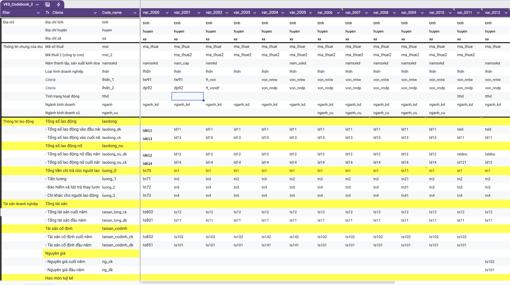

# How to use this codebook? {#cleaning}
## Overview {#cleaning-overview}

You likely have a task related to the Vietnam Enterprise Survey (VES) dataset, or you simply want to explore the situation of enterprises in Vietnam, but you don't know where to start. We often begin by downloading the data, struggling with a mess of messy variables, then fumbling to find questionnaires, determining which question corresponds to which variable in the data, and noting potential issues. This typical process often consumes a lot of time and can even lead to errors due to the massive amount of information.

Therefore, this codebook focuses on two main issues:

1) Providing you with an enterprise dataset cleaned according to DEPOCEN's process, so you can immediately start analyzing and exploring the data without struggling with raw data issues.
2) Explaining the processing procedure so you can verify the process, raise questions about issues you encounter, and contribute to improving the process further.

Regardless of your purpose for coming here, your usage and contributions are crucial for us to improve even more.


## If you just want to use the cleaned data {#use-cleaned-data}

If you just want to use the cleaned data, you can access this link: [**here**](https://drive.google.com/open?id=1FwfSDzEThzsyMPOXh1CnJOyMp0tXKHg1&usp=drive_fs). Chose the file that you want to download, and download it to your local machine. Please, only dowload the file that you need, do not modify anything in this folder.

The final data cover from 2000 to 2021, with the following variables:

- Tax code
- Secondary tax code
- Year (survey/reference year)
- Survey province code
- Survey district code
- Survey commune/ward code
- Year of starting production and business
- Enterprise operating status
- Type of enterprise
- VSIC 2018 4‑digit industry code
- VSIC 2007 4‑digit industry code
- VSIC 1993 4‑digit industry code
- Number of employees
- Number of female employees
- Total expenses related to employees
- Total assets
- Fixed assets
- Historical cost
- Accumulated depreciation
- Construction in progress
- Total liabilities
- Total revenue
- Revenue from sale of goods and services
- Net revenue from sale of goods and services
- Cost of goods sold
- Reductions in revenue
- Financial income
- Other income
- Profit before tax
- Corporate income tax expense
- Import activity (yes/no)
- Export activity (yes/no)
- Has import or export activities

If you want to check what is the raw name of each variables in the raw data, you can access the data dictionary [**here**](https://docs.google.com/spreadsheets/d/1z1FoluAF2u6vSx7LM_uHxjLDjmr7d3JHDB1zvJiu-cs/edit?gid=52042540#gid=52042540).

## If you want to know how we clean the data {#clean-data}

If you want to know how we clean the data, you can dowload the raw data from the link here [**here**](https://drive.google.com/drive/folders/1EDgL9KqYd5ZnVLpDItbqUxT8wdMyy5Lq?usp=drive_link), and follow the steps below to clean the data.

The raw data is organized in the following folder structure: The data folder for each year is named as "VES_year". In each folder, there are plenty of dta data file, you should only focus on the file that is named as "dn_year.dta". That is the data that you need to clean. For other files, you can ignore them, we will update on how to use them in the future.

The folder that you dowload is "01_raw", It also include the questionaires for each year that we use to clean the data. If available, read it carefully to understand the context of the data.

Now, you create a new folder for your project, and put the raw data and questionaires in it.

```
# Example folder structure
# 01_raw/       - Raw datasets and questionaires
# 02_temp/      - Temporary files
# 03_clean/     - Cleaned datasets
# 04_output/    - Output files
```

Then, you need to dowload this stata script [**here**](https://drive.google.com/file/d/1vlgxfHo7MrRWSOlW0lmsaXpjT3R-3FMH/view?usp=drive_link), and put it in your project folder.

```
# Example folder structure
# 01_raw/       - Raw datasets and questionaires
# 02_temp/      - Temporary files
# 03_clean/     - Cleaned datasets
# 04_output/    - Output files
# 00_setup.do   - Setup and clean script
```

Run the setup script to setup the folder and clean the data, before running the script, you need to set up the directory of the project folder

```stata
// -------------------------------------------------------------------------- //
**# Set Working Directory
// -------------------------------------------------------------------------- //

* User must uncomment the following line ("global ...") and set the filepath equal to the folder containing this run.do file 
gl MyProject ".../your_project_folder/"
	gl data "$MyProject/data"
		gl raw 		"$MyProject/01_raw"
		gl tem 		"$MyProject/02_temp"
		gl clean 	"$MyProject/03_clean"	
		gl out	 	"$MyProject/04_output"

```

I will explain the script below:

A common issue when cleaning survey data spanning multiple years, especially with VEC, is the inconsistency in variable names and content across years. To address this, we synchronize variable names and content across years using an Excel file that maps variables from different years to a single standardized format.

You can copy the Excel link in the code below to download this file. The structure of the Excel file is shown in the image below:

{width=100%}

```stata
// -------------------------------------------------------------------------- //
**# 0. Make the dofile for each year
// -------------------------------------------------------------------------- //

	import excel "https://docs.google.com/spreadsheets/d/1z1FoluAF2u6vSx7LM_uHxjLDjmr7d3JHDB1zvJiu-cs/export?format=xlsx", ///
		clear firstrow
	
		drop if Code_name == ""
		
	local N = _N
	
	forval i = 2000/2021 {
		file open myfile using `"$tem/label`i'.do"', write text replace
		
		local renamed_vars ""
		forval iii = 1/`N' {
			local vvvcode = Code_name[`iii']
			local vvv_i = var_`i'[`iii']  
			
			if `"`vvv_i'"' != "" {
				local result = `"ren `vvv_i' `vvvcode'"'
				local renamed_vars "`renamed_vars' `vvvcode'"
				* Ghi dòng kết quả vào tệp do-file
				file write myfile `"`result'"' _n
			}
		}
		file write myfile `"keep `renamed_vars'"' _n
	
		file close myfile
		}
```
After running the code above, Stata will generate 22 do-files, one for each year. These do-files contain commands to synchronize variable names and content across years.

We will now use these do-files to standardize the data. Once the variable names are synchronized, we can easily append the yearly data to create a panel dataset using the following command:

```stata
// -------------------------------------------------------------------------- //
**# 1. Rename raw data for each year and make panel data
// -------------------------------------------------------------------------- //
	
clear all

	tempfile combined_data
	save `combined_data', emptyok replace
	
	forval i = 2000/2021 {
	
		di "Processing year `i'..."
	
		* Load data
		use "$raw/VES_`i'/dn`i'.dta", clear
	
		* Run rename do-file
		do "$tem/label`i'.do"
	
		* Generate year
		gen year = `i'
		
		if year == 2013 {
			gen huyen = .
			gen xa = .
		}
		
		foreach var in tinh huyen xa nganh {
			capture confirm numeric variable `var'
			if _rc {
				destring `var', replace force
				}
			}
		
		* Append safely
		append using `combined_data'
	
		* Save back to tempfile
		save `combined_data', replace
	}
			
	save "$tem/ves_00_21.dta", replace
```

The result is a "ves_00_21.dta" file, which is a panel dataset with synchronized variable names. However, since survey content may vary by year, specific adjustments are needed to ensure consistency.
We use the command below to keep only the variables of interest and order them as desired.
```stata
// -------------------------------------------------------------------------- //
**# 2. Tidy Clean panel data
// -------------------------------------------------------------------------- //
	* ssc install keeporder // if you have not installed this package

	use "$tem/ves_00_21.dta", clear
	
	keeporder 	mst mst_2 year																	///																	
				tinh huyen xa 																	///																		
				namsxkd tthd lhdn lhdn_1 lhdn_2 nganh nganh_cu									///							
				laodong_dk laodong_ck laodong_nu_ck laodong_nu_dk 								///									
				luong_0 luong_1 luong_2 luong_3 												///						
				taisan_tong_dk taisan_tong_ck 													///				
				taisan_codinh_dk taisan_codinh_ck ng_dk ng_ck hmlk_dk hmlk_ck xdcb_dk xdcb_ck 	///																
				nophaitra_dk nophaitra_ck														///			
				tongdoanhthu																	///
				doanhthubanhang doanhthuthuan giavon giamtru									///								
				doanhthutaichinh doanhthukhac													///				
				tongloinhuan thuethunhap  														///			
				loinhuan_lai loinhuan_lo loinhuan_sau_lai loinhuan_sau_lo						///											
				nhapkhau xuatkhau xuatnhapkhau																	
```

Location variables are crucial as they indicate the geographical distribution of enterprises across communes, districts, and provinces. However, these variables may vary across years due to administrative boundary changes. This section is currently being updated, but you can still reliably use province-level data, as provincial boundaries have not changed significantly during the 2000-2021 period.

```stata
**## 2.1. Clean Location Variables
* Under development
```
Similarly, enterprise types are classified differently in different periods. We have constructed a new classification system that is comprehensive and consistent across years. You can refer to this by copying the link in the code to download the Excel file for details.

The command below merges the enterprise type (`lhdn`) from each year with the new classification, creating a new variable named `lhdn_dpc`.

```stata
**## 2.2. Clean type of enterprises 

	preserve
		import excel "https://docs.google.com/spreadsheets/d/1z1FoluAF2u6vSx7LM_uHxjLDjmr7d3JHDB1zvJiu-cs/export?format=xlsx&gid=1229044769", ///
			clear firstrow

		tempfile cw_lhdn
		save `cw_lhdn'
	restore

	merge m:1 lhdn year using `cw_lhdn'
		drop if _m == 2
		drop _m
```	

Industrial classification is much more complex than other variables due to the large number of industry codes and two major revisions: VSIC 2007 and VSIC 2018. We address this by creating crosswalk data files to map new industry codes to old ones, generating three new variables: `vsic4_2018`, `vsic4_2007`, and `vsic4_1993`. This allows users to conveniently choose the industry classification that suits their research purpose.
The code is quite complex, but the underlying principle is simple.

```stata
**## 2.3. Clean industrial Classification 

	replace nganh = int(nganh/10) if year == 2004 | year == 2005				// need check

	gen vsic4 = int(nganh/10) if year >= 2004
		replace vsic4 = nganh if year <= 2003

	preserve
		use "$tem/cw_vsic_2018_2007_1993", clear
			duplicates drop vsic4_2018, force
		save "$tem/cw_vsic_2018", replace
		
		use "$tem/cw_vsic_2018_2007_1993", clear
			duplicates drop vsic4_1993, force
		save "$tem/cw_vsic_1993", replace
	restore
	
	preserve
		keep if year >= 2019
		ren vsic4 vsic4_2018
		
		merge m:1 vsic4_2018 using "$tem/cw_vsic_2018"
			drop if _m == 2
			drop _m 
		
		tempfile vsic4_2018
		save `vsic4_2018', replace
	restore
	
	preserve
		keep if year <= 2019 & year >= 2006
		ren vsic4 vsic4_2007
		
		merge m:1 vsic4_2007 using "$tem/cw_vsic_2018_2007_1993"
			drop if _m == 2
			drop _m 
		
		tempfile vsic4_2007
		save `vsic4_2007', replace
	restore
	
	preserve
		keep if year <= 2005
		ren vsic4 vsic4_1993
		
		merge m:1 vsic4_1993 using "$tem/cw_vsic_1993"
			drop if _m == 2
			drop _m 
		
		tempfile vsic4_1993
		save `vsic4_1993', replace
	restore
	
	use `vsic4_2018', clear 
		append using `vsic4_2007'
		append using `vsic4_1993'
				
/*	
	import excel "https://docs.google.com/spreadsheets/d/1z1FoluAF2u6vSx7LM_uHxjLDjmr7d3JHDB1zvJiu-cs/export?format=xlsx&gid=299465942", ///
		clear firstrow
	
			drop if _n >= 668
			destring vsic4_2007 vsic4_1993, replace
			replace vsic4_2007 = int(vsic4_2007/10)
			keep vsic4_2007 vsic4_1993

			duplicates drop vsic4_2007, force
			
		save "$tem/cw_vsic_2007_1993", replace
		
		
	import excel "https://docs.google.com/spreadsheets/d/1z1FoluAF2u6vSx7LM_uHxjLDjmr7d3JHDB1zvJiu-cs/export?format=xlsx&gid=567783578", ///
		clear firstrow
	
			drop if _n >= 471
			keep vsic4_2018 vsic4_2007
			
			duplicates drop vsic4_2007, force		

				merge 1:1 vsic4_2007 using "$tem/cw_vsic_2007_1993"
					drop if _m == 2
					drop _m
		
		save "$tem/cw_vsic_2018_2007_1993", replace
					
*/	
```

Next, we clean variables with beginning-of-year and end-of-year values. The principle here is to use the `rowmean` command, which handles cases where either the beginning or end value is missing.
Additionally, international trade variables like export and import are converted to dummy variables (0 for no, 1 for yes). In the raw data, these variables have various formats (import/export value, tax, etc.), so we simplify them to dummies. Note that for those interested in deep trade analysis, import/export values cannot be consistently extracted from the raw data as they were asked in very few years.

```stata
**## 2.4. Clean labor indicators

		**### Total number of labor
		egen laodong = rowmean(laodong_dk laodong_ck)				

		**### Total number of female labor
		egen laodong_nu = rowmean(laodong_nu_dk laodong_nu_dk)				
				
		**### Total expenses related to labor
		egen luong = rowtotal(luong_1 luong_2 luong_3)
			replace luong = luong_0 if luong_0 != . 

	
**## 2.5. Clean Asset indicators

		**### Total assets
		egen tongtaisan = rowmean(taisan_tong_dk taisan_tong_ck)				

		**### Fixed Asset
		if (year >= 2000 & year <= 2011) | year == 2019 | year == 2020 {
			egen tscd = rowmean(taisan_codinh_dk taisan_codinh_dk)				
		}
		
		**### Historical cost, accumulated depreciation, onstruction in progress (CIP)
		foreach var in ng hmlk xdcb {
			egen `var' = rowmean(`var'_dk `var'_ck)								
		}
	
		replace xdcb = 0 if xdcb == .
		replace tscd = ng - hmlk + xdcb if  (year >= 2012 & year <= 2018) |	year == 2021
		
		**### liabilities
		egen nophaitra = rowmean(nophaitra_dk nophaitra_ck)						
			
**## 2.6. Clean business result indicators 
			
		**### Total profit before tax
		replace tongloinhuan = loinhuan_lai - loinhuan_lo if year == 2000 | year == 2001


**## 2.7. Clean trade indicator 

		replace nhapkhau = 0 if nhapkhau == . | (nhapkhau == 2 & year == 2004)	
		replace xuatkhau = 0 if xuatkhau == . | (xuatkhau == 2 & year == 2004)	
		
		replace nhapkhau = 1 if nhapkhau != 0	
		replace xuatkhau = 1 if xuatkhau != 0 

		replace xuatnhapkhau = 0 if xuatnhapkhau == 2 | xuatnhapkhau == .
		replace xuatnhapkhau = 1 if xuatkhau == 1 | nhapkhau == 1
		
**## 2.8. Keep interested variables 
		
	keeporder 	mst mst_2 year																	///																	
				tinh huyen xa 																	///																		
				namsxkd tthd lhdn vsic4_2018 vsic4_2007 vsic4_1993  							///							
				laodong laodong_nu																///									
				luong							 												///						
				tongtaisan					 													///				
				tscd ng hmlk xdcb 																///																
				nophaitra																		///			
				tongdoanhthu																	///
				doanhthubanhang doanhthuthuan giavon giamtru									///								
				doanhthutaichinh doanhthukhac													///				
				tongloinhuan thuethunhap  														///			
				nhapkhau xuatkhau xuatnhapkhau																	

	save "$tem/tiny_data.dta", replace
```

After cleaning, we need to label the variables for easy understanding and usage.

```stata
* ---------------------------------------------------------------------------
**# 3. Label variables and label value 
* ---------------------------------------------------------------------------

	iecodebook apply using "$tem/codebook_tiny_data.xlsx"
	
	save "$cle/ves_00_21.dta", replace 
	
	forval val = 2000/2021 {
		preserve
			keep if year == `val'
			save "$cle/ves_`val'.dta", replace 
		restore
	}

```


